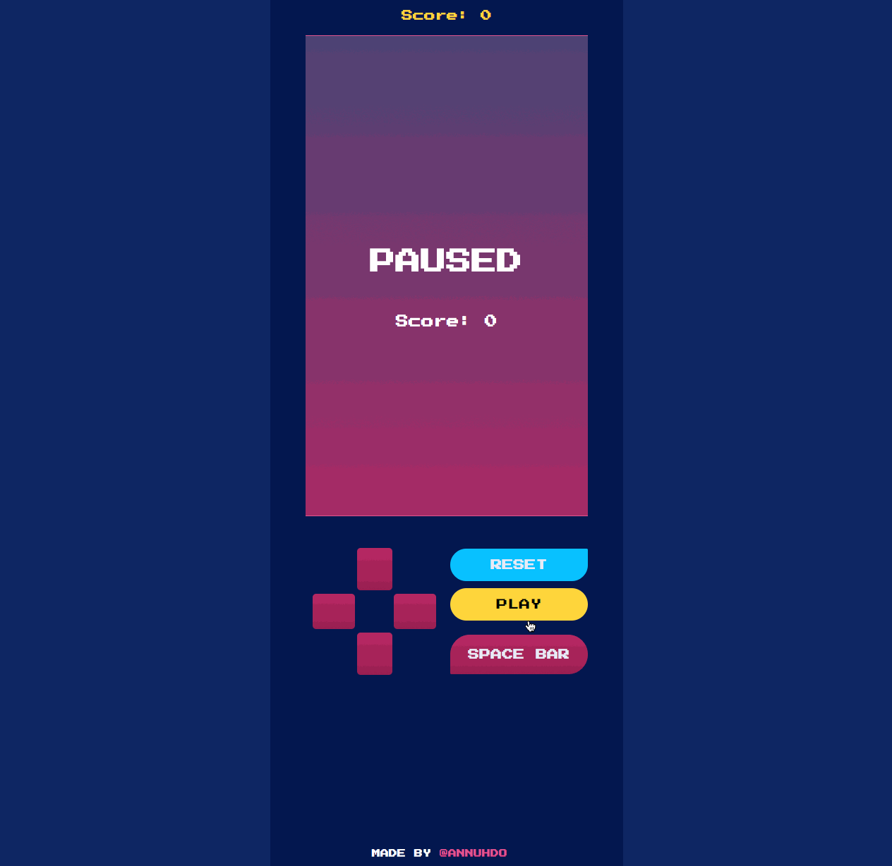

# Tetris 🎮

Tetris game built with React + Redux 👾
[Check it out!](https://tetris-redux-xfvkqhjzxp.now.sh/ "Game site")

Built using:
- [Redux](http://redux.js.org/) for state and action management.
- [React](https://github.com/facebook/react) for UI view.

# Controls
- `Enter` to Play/Pause the game
- `Space bar` to hard drop the shape
- `Left` to shift left
- `Right` to shift right
- `Up` to rotate
- `Down` to accelerate soft drop

The game also provide buttons that allow user to click to play.

# Rules
- A line can be eliminated when the whole row is filled.
- 40 points for 1 line, 100 for 2 lines, 300 for 3 lines, and 1200 points for 4 lines.

# How the game is built
- Each tetromino shape is hard coded as a matrix of 0's and #'s. This allows dynamic rotation by rotating the matrix 90 degrees.
- #'s in the tetromino's matrix is a random number between 1-5 that maps to a color. Source: /src/components/model/index.js
- Shapes are built using CSS positioned absolute.
- Action thunks are used to lay out the logic of drop timer.
- Reducers are only used to return the current shape's state and grid after clearing lines.
